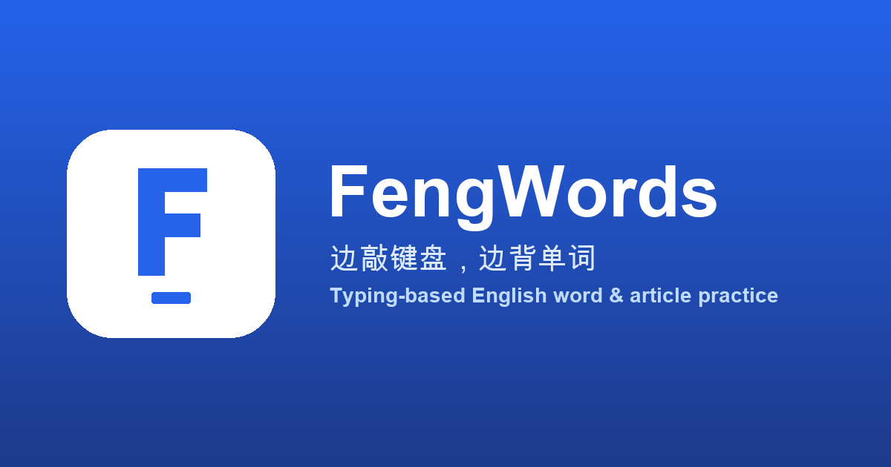

<div align="center">

# FengWords

**一个基于打字练习的英语单词 / 文章学习工具** — 边敲键盘边背单词，让记忆更主动、更高效。

*A typing-based tool for learning English words and articles.*



</div>

---

## English (summary)

FengWords is a web app for learning English vocabulary and articles by *typing them out* —
active recall beats passive reading, so you remember faster and stay focused. Built with
Nuxt 4 + Vue 3, with a Vercel server API and a Neon PostgreSQL database. Learning data
is cached locally and automatically synced online. A private recovery code lets you
connect another device without entering database credentials. The UI supports 14 languages.

It includes a **one-click vocabulary import** tool so you can bring your own word lists into
the app (see [Importing your own words](#importing-your-own-words--导入自己的词库)).

## 简介

FengWords 是一款「用打字来背单词」的英语学习工具：不是被动地看，而是把单词逐字敲出来，
边练打字边记拼写，记忆更牢、更专注。除了单词，也支持整篇文章的逐句打字练习。

前端保留浏览器本地缓存，后端通过 Vercel Functions 将学习进度、收藏、错词等数据保存到 Neon PostgreSQL；
无需手动填写数据库 URL / Key，通过私密恢复码连接另一台设备；
界面支持中、英、日、韩、俄等 14 种语言。

## 主要功能 / Features

**单词练习 / Word Practice**
- 四种模式：跟打 / 听写 / 自测 / 根据拼写回忆。
- 智能模式：按记忆曲线自动安排待学单词，通过听写加深记忆；自由模式可自主规划。
- 提供音标、美/英发音、例句、词组、近义词、词根词缀、词源与错词统计等。

**文章背诵 / Article Memorization**
- 内置经典教材，也可自行添加 / 导入文章，支持一键翻译与中英对照。
- 跟打 + 听写双模式，逐句输入并自动发音；支持边听边默写。

**收藏 / 错词 / 已掌握**
- 打错的词自动进入错词本，便于复习；主动标记已掌握的词会在后续练习中跳过；收藏便于集中回顾。

**词库 / Vocabulary Library**
- 内置 CET-4/6、GMAT、GRE、IELTS、SAT、TOEFL、考研、专四、专八等常用词库。

**高度可定制 & 简洁高效**
- 丰富的键盘音效、可自定义快捷键、大量设置项；界面清爽现代、无广告、不强制订阅。

## Importing your own words / 导入自己的词库

内置自包含的词汇导入能力：

- 打开 **`/vocab-import`** 页面，一键载入预置词表（数据文件位于 `public/vocab-import.json`），
  点「导入到词库」即可写入词库，并自动同步到线上数据库，随后在 **`/words`** 页面选择使用。
- 词表格式为简单的 `[{"word": "...", "trans": "..."}]`，`trans` 支持用换行 `\n` 分行列出多个义项。
- 另有一份错词词表 `public/cuoci-import.json`，可通过 `app/plugins/99.seed-vocab.client.ts`
  在应用启动时自动播种到浏览器词库。

> 词库数据先写入浏览器缓存（IndexedDB），再通过同源 API 上传到当前私密云端词库。离线改动会保留，联网后重试。

## 技术栈 / Tech Stack

| 领域 | 选型 |
| --- | --- |
| 框架 | Nuxt 4 / Vue 3 |
| 语言 | TypeScript |
| 状态管理 | Pinia + Dexie / IndexedDB 离线缓存 |
| 后端 | Nuxt Nitro / Vercel Functions |
| 线上数据库 | Neon PostgreSQL（服务端 HTTP 驱动） |
| 样式 | UnoCSS + SCSS |
| 国际化 | 自研 i18n（`i18n/locales/*.json`，可用 `pnpm i18n:write` 从 Excel 生成） |

## 快速开始 / Getting Started

前置要求：**Node.js**（建议较新 LTS）与 **pnpm**。

```bash
git clone https://github.com/WilliamFeng7/FengWords.git
cd FengWords

pnpm install     # 安装依赖
vercel env pull .env.local --yes  # 拉取真实数据库连接（仅保存在本机）
pnpm db:migrate  # 显式、非破坏性建表
pnpm dev         # 启动开发服务器，自动加载 .env.local
```

开发服务器默认地址为 **http://localhost:5567**（端口在 `nuxt.config.ts` 的 `devServer.port` 中配置）。

生产构建：

```bash
pnpm build       # 产物输出到 .output/
pnpm test        # 数据验证、记录持久化单元测试
pnpm test:cloud  # 开发服务器运行时验证真实线上数据库接口
```

> 不能只部署 `pnpm generate` 的静态产物：线上数据库需要 Nuxt 服务端 API。Vercel 项目使用 `pnpm build`，自动生成 Nitro Functions。数据库未配置时设置页会明确显示错误，不会假装已上传。

## 线上数据库与设备恢复

- Vercel 项目：`fengsprojects/fengwords`；Neon 免费资源：`fengwords-db`，新加坡区域。当前 Development / Preview / Production 由 Marketplace 注入数据库环境变量。
- 浏览器只调用 `/api/cloud/*`；`DATABASE_URL` 仅由服务端读取，**不进入 `runtimeConfig.public`**，不要提交 `.env.local`。
- `fw_workspaces`：每个私密词库的身份，服务端仅存恢复密钥的 SHA-256 摘要；`fw_records`：词典、词条、统计、FSRS 卡片、笔记、设置、练习缓存和自定义流程；`fw_rate_limits`：跨 Function 实例限流。
- 第一次使用自动创建独立词库，并将已有本地记录上传；旧 IndexedDB / idb-keyval 数据及迁移前快照保留。
- **设置 → 数据同步 → 复制恢复码**。在另一个设备打开相同站点，输入恢复码并确认，即可恢复。恢复码等同于词库密码，持有码的人能访问数据；请不要公开。当前版本不是邮箱账号登录，丢失全部设备会话和恢复码后无法通过邮箱找回。
- 恢复之前会保留 ZIP 备份，并先下载完整云端记录再替换本地。恢复不会覆盖云端，可在同页下载恢复前备份。
- 修改先写本地，学习记录按条上传；服务端原子比较修改时间，旧离线设备不能覆盖较新记录。删除以 tombstone 同步。回到页面、恢复网络及每 30 秒触发重试。
- **清空数据会作用于本机及当前连接的云端词库**，界面会先确认；不影响其他私密词库。重要数据仍建议定期导出 ZIP。
- 自定义文章的本地音频 Blob 暂不上传；存在此类音频时学习数据同步会明确报错，音频仍可随 ZIP 导出。需要跨设备音频时应另外接入对象存储，不能只把本机文件 ID 当作可用云端文件。
- 内置公共词库与音频继续作为静态资源发布，不重复写入每个用户的数据库。

### 部署

```bash
vercel link          # 使用已有 fengwords 项目
vercel env pull .env.local --yes
pnpm db:migrate      # 每次 schema 更新时显式执行，禁止在请求中自动建表
pnpm build
vercel deploy --prod
```

新环境先通过 Vercel Marketplace 连接 Neon 并配置 `DATABASE_URL`。迁移脚本优先使用 `DATABASE_URL_UNPOOLED`。当前三个环境连接同一资源；如需隔离测试数据，配置 Neon 预览分支后再运行测试。测试脚本仅创建独立测试词库，不操作用户词库。

## 目录结构（节选）

```
FengWords/
├─ app/                 # 页面、组件、逻辑（Nuxt app 目录）
│  ├─ pages/            # 路由页面（含 vocab-import.vue）
│  ├─ components/       # 业务组件
│  ├─ base/             # 基础 UI 组件
│  └─ plugins/          # 运行插件（含 99.seed-vocab.client.ts）
├─ public/              # 静态资源、词表 JSON、音频
├─ i18n/                # 语言包与 Excel 源表
├─ nuxt.config.ts       # Nuxt 配置
└─ gulpfile.js          # i18n 生成任务
```

## 许可证 / License

本项目基于 **GNU GPL v3** 许可证开源，详见 [LICENSE](./LICENSE)。
